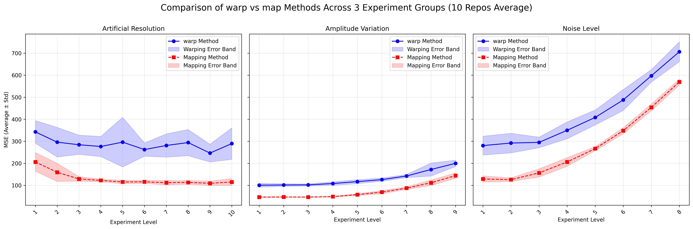
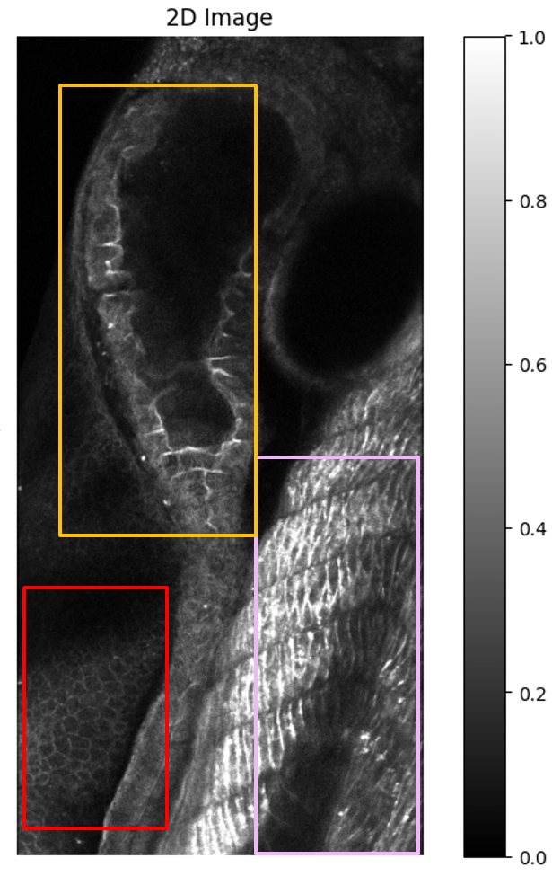
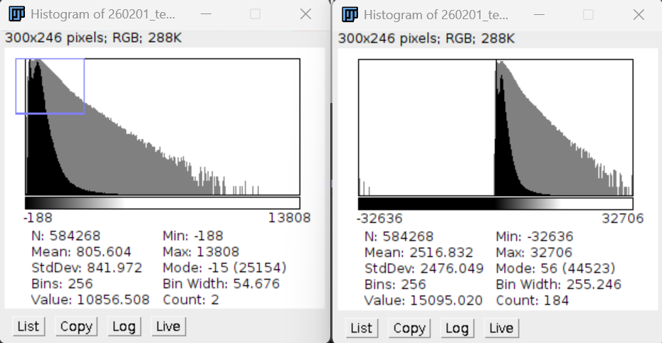
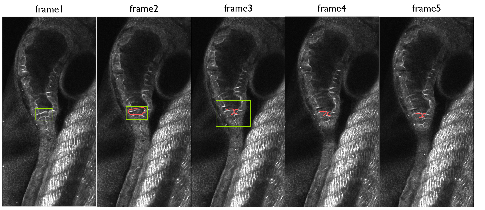
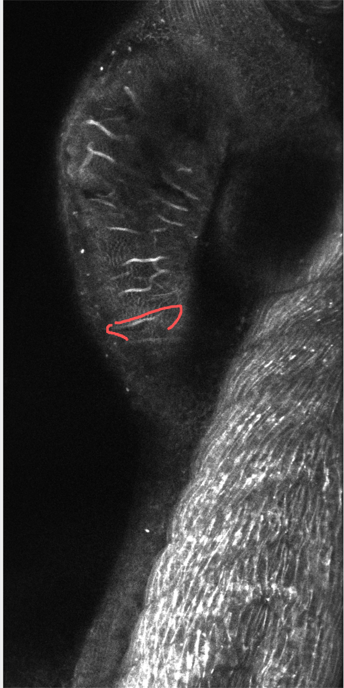

## WHOLISTIC Registration Pipeline(High resolution)

# Remodel
Instead of searching for a motion field to warp the moving image, we could find a mapping from moving image to reference image. We could regard the reference as world coordinates and regard it as a dense space by interpolating. We could know the intensity of each point even if it's not on the grid.

$$
\begin{aligned}
\phi: \Omega_{move} &\to \Omega_{ref} \\
X &\to \phi(X) \in \Omega_{ref}
\end{aligned}
$$

So the loss function is changed to:

$$
\begin{aligned}
L(\phi)
&=[I_{ref}(\phi(X)) - I_{mov}(X)]^2 + \lambda \nabla(\phi)^2 
\end{aligned}
$$

Just like the way we did before, we can regard the mapping as a linear model:

$$
\begin{aligned}
\phi: \Omega_{move} &\to \Omega_{ref} \\
X &\to \phi(X) = X_0' + \Delta X' \\
&= X_0' + \Delta X_a + \Delta X_s \\
\text{s.t. } X_0' &\in \Omega_{ref}
\end{aligned}
$$

where \(X_0'\) is a initial mapping
And we could rewrite the loss function as:

$$
\begin{aligned}
    L(\phi)&=[I_{ref}(\phi(X))-I_{mov}(X)]^2+\lambda\nabla(\phi)^2\\
    &=[I_{ref}(X'+\Delta X_a'+\Delta X_s')-I_{mov}(X)]+\nabla(\Delta X_a+\Delta X_s-\overline{\Delta X_a})^2\\
    &=[I_{ref}(X'+\Delta X_a')+\frac{\partial I_{\text{ref}}(X'+\Delta X_a')}{\partial X} \Delta X_a'-I_{mov}(X)]^2\\
    &+\nabla(\Delta X_a+\Delta X_s-\overline{\Delta X_a})^2
\end{aligned}
$$

Then we have

$$
\begin{aligned}
   \frac {\partial L(\phi)}{\partial \Delta X_a'}&=2\frac{\partial I_{\text{ref}}(X'+\Delta X_a')}{\partial X}[I_{ref}(X'+\Delta X_a')-I_{mov}(X)+\frac{\partial I_{\text{ref}}(X'+\Delta X_a')}{\partial X} \Delta X_a']\\
   &+2\lambda (\Delta X_a+\Delta X_s-\overline{\Delta X_a})\\
   &=0\
\end{aligned}
$$

The format is the same as before, so we needn't to change the solution.

# Simulation
We use a method to build motion field in a more continuous and biophysically motivated way.It first generates dense random fields in the lateral directions (\(x\)and \(y\)), and then smooths them with anisotropic Gaussian filtering to obtain spatially coherent lateral deformations. The axial motion (\(z\)) is not generated independently; instead, it is derived from the depth-wise gradients of the lateral motion fields. In this way, the z-direction displacement is coupled to the variation of lateral deformation across depth, which makes the simulated motion more consistent with realistic volumetric tissue deformation. The amplitudes of lateral and axial motion are normalized separately, allowing independent control of in-plane and out-of-plane motion strength.

Previously, we just randomly select some control poins and generate motion for them, and then smooth the motion field. It will cause some extreme motion in some places, which can't be seen in real bio-images.

We did 10 repeats with various motion smoothness scale, deformation amplitude, and noise level. Here's the result:

# Pre-pross and post-procee
## 1.How to get the init mapping
For the genuine slice-to-volume registration problem, the first step we need to take is to estimate the initial corresponding matches of the slices in the z-direction. Naturally, we can adopt the simplest approach: compute the correlation for each slice individually, and then select the slice with the maximum correlation as the initial position. However, a problem arises here: quite often, the imaging region contains distinct objects that may be biologically disconnected, and thus they naturally do not correspond to the same target. Therefore, we may need to calculate the optimal initial z-position for each pixel, or more simply, for each patch.
Our approach aims to robustly estimate, for each local image region (patch), the most likely depth (z position) in a 3D reference volume that corresponds to a given 2D moving slice. Instead of relying on a single “best match” slice (which can be unstable in noisy or ambiguous cases), we treat the entire matching curve across all candidate z slices as meaningful information.

For each patch, we compute a similarity score with every z slice in the reference volume using a normalized cross-correlation measure, denoted as s(z). This produces a curve over z that reflects how well the patch matches each depth. Rather than selecting only the maximum value of this curve, we convert the entire curve into a soft probability distribution over z:

$$p(z) = exp(β * s(z)) / sum_{z'} exp(β * s(z'))$$

Here, β controls how sharply the distribution concentrates around high-scoring slices. This distribution can be interpreted as the degree of support that each z slice receives from the current patch. Using this distribution, we define the patch’s estimated depth as the weighted average:

$$μ = sum_z z * p(z)$$

This allows us to naturally handle cases where multiple nearby slices are similarly good matches (e.g., broad or flat peaks), avoiding unstable jumps caused by selecting a single maximum.

In addition to estimating depth, we define a confidence value C for each patch that reflects how reliable its matching information is. This confidence is designed to capture not only how strong the best match is, but also how meaningful and well-structured the entire curve is. It consists of two components.

The first component measures the strength of evidence:

$$C_{evidence} = \frac{max_z s(z) - median_z s(z)}{ 1 - median_z s(z) + ε}$$

This term evaluates how much the best match stands out relative to the typical level of the curve. If all slices have similar scores (i.e., no clear preference), this value will be low, indicating that the patch does not provide useful depth information.

The second component evaluates the shape quality of the curve. It combines two factors. The first is how concentrated the probability mass is around the main peak:

$$C_{local} = sum_{|z - z_peak| ≤ r} p(z)$$

where z_peak is the location of the highest score, and r defines a local neighborhood. This term is high when the distribution is concentrated within a contiguous region (either a sharp peak or a smooth broad peak), and low when the distribution is split across multiple distant peaks.

The second factor evaluates how smooth the curve is:

$$C_{smooth} = exp(-α * R)$$

where R measures the amount of high-frequency fluctuation in the curve (e.g., using second-order differences). This term penalizes irregular or noisy curves that may produce spurious peaks.

These two factors are combined as:

$$C_{shape} = 0.5 * C_{local} + 0.5 * C_{smooth}$$

Finally, the overall confidence is defined as:

$$C = clip(C_{evidence} * C_{shape}, 0, 1)$$

This formulation ensures that a patch is considered reliable only if it both has strong evidence (a meaningful peak relative to background) and a well-structured, smooth curve. As a result:

- Patches with a sharp, high peak receive high confidence.
- Patches with a smooth, broad peak (indicating a consistent but less precise depth region) also receive high confidence.
- Patches with multiple competing peaks or noisy fluctuations receive lower confidence.
- Patches with uniformly low scores receive very low confidence.

After obtaining a depth estimate μ and confidence C for each patch, we further enforce spatial consistency across neighboring patches by solving a regularized optimization problem:

$$min_{z_{ij}} sum_{i,j} C_{ij} * (z_{ij} - μ_{ij})^2 + λ * sum_{(i,j)~(k,l)} (z_{ij} - z_{kl})^2$$

Here, z_ij is the final depth assigned to patch (i,j), μ_ij is its local estimate, and C_ij is its confidence. The first term ensures that high-confidence patches stay close to their own estimates, while the second term encourages neighboring patches to have similar depths. This allows unreliable patches to be guided by their more reliable neighbors, leading to a globally consistent depth map.

Overall, this framework replaces a brittle “winner-takes-all” strategy with a probabilistic and context-aware approach, making it significantly more robust to noise, ambiguous matches, and biological variability in the data.

## 2.How to escape from the local optimum
In the refinement stage, our goal is not simply to reduce the global loss, but to specifically address regions where the current correspondence is likely trapped in a local optimum. We begin by evaluating the local matching error on small patches centered at control points. For each patch, we compute a residual-based measure such as $r(X) = I_{mov}(X) − I_{ref}(φ(X))$, and aggregate it within a neighborhood to obtain a patch-level error. Instead of relying on a fixed threshold, we use a robust statistic (median and MAD) across all patches to identify regions whose error is significantly higher than the global background level. These regions are considered “problematic” because they indicate that the current mapping φ is inconsistent with the underlying image structures.

However, not every point inside a high-error region contributes equally to the local failure. In practice, we observe that within such regions, there are often subareas where the error is relatively lower. These points are not necessarily correct; rather, they tend to be the locations where the optimization has settled into a locally consistent but globally incorrect match. In other words, they act as local attractors that pull the surrounding region into a suboptimal configuration. Therefore, instead of masking the entire high-error region, we further refine our selection by focusing on those points inside the region that exhibit comparatively low residual error (e.g., by selecting a top quantile based on local consistency). These points are interpreted as candidates that may have “locked” the solution into a local minimum.

To encourage the system to escape from this local optimum, we project these selected points from the moving image into the reference space using the current mapping φ. This gives a set of locations φ(X) in the reference that correspond to the suspected attractors. We then construct a mask in the reference space that suppresses these locations (and their immediate structural neighborhood), effectively preventing the algorithm from reusing the same correspondence. Importantly, this masking is not arbitrary; it is applied in the reference domain because the local minimum is defined by where the moving image is being mapped to, rather than where it originates from.

After constructing this reference-side mask, we rerun the registration step under the modified constraint that φ(X) should avoid these previously selected regions. This can be interpreted as temporarily altering the energy landscape: the algorithm is no longer allowed to minimize the objective by staying near the previous local optimum, and is instead forced to explore alternative matches. In practice, this often leads to the selection of a different correspondence that may have been slightly less favorable under the original objective, but is more globally consistent.

Once a new mapping is obtained, we compare it with the previous solution and accept it if it leads to a meaningful reduction in the overall error. The masking is then removed or relaxed, and the optimization continues in a standard refinement mode. Conceptually, this procedure allows the algorithm to iteratively identify and break out of locally stable but incorrect matches, without disrupting regions that are already well aligned.
# Remained Question
## 1.What is the true zRatio of the image? 
From my current experiments, setting zRatio=1 yields good results. The true zRatio values I read from the anno and raw data are different (and the x and y ratios also seem to differ; did I read them incorrectly?).

## 2.The distribition is quite different, and I'm not sure what the exact reason is.

Now we use the histgram mapping to correct the pixels, but it depends on if we have the two sample shape images. Or we just use a simple transform from the sampe plane to correct all the pixels

## 3.What I find strange from a biological perspective

I’m now unable to find correspondences between the two images for some structures. We achieve relatively good results on dorsal and ventral data because there isn’t significant motion in those datasets. However, it has become challenging for us to properly register all frames for the gut data.
In my observation, the last three frames of the gut/raw data (slice 79) look quite similar. Currently, we use the 3rd frame as the reference, and we can register the 4th and 5th frames very well, but the first two frames cannot be properly aligned.
I think the main issue is that the first two frames appear to contain an extra structure, as I circled in the figure. The last three frames all show a structure like two fingers pressed together. In contrast, the first frame shows a closed structure, which then breaks in the second frame, and splits into two lobes in the last three frames.

From other slices, it seems that in the later frames, this tissue has moved to a very superior position (e.g., slice 69 of the 3rd frame). Given such a large deformation, I believe it will be very difficult for us to handle this registration.
{: width="269" height="543"}