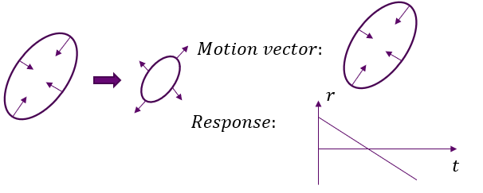

# Corresponding files
## motion_correlation_pattern.py
the main file to analyse and visualize motion
## motion_stage_cache.py
the file to store the temp results

# Methods
## Abstract
Essentially, our goal is to identify regions, timestamps and specific patterns of genuine significant motion (excluding artifacts) from the displacement fields obtained via image registration, and we split this workflow into four sequential steps.
## Pipeline
### Extract motion units
#### Assumptions
For any given region, motion is either absent or consists of small random fluctuations for most of the time, with pronounced movement occurring only sporadically at a small subset of time points. Our target is to extract these prominent motion events.
#### 1.compute patch-wise motion
In fact, we do not need to perform motion analysis down to the single-pixel level. Even if meaningful motion exists within such tiny regions, reliable identification of these movements cannot be guaranteed. Accordingly, we simply partition the full image into a grid of non-overlapping n×n patches, where the motion value of each patch is defined as the average motion across all constituent pixels inside the patch.

#### 2.estimate the resting-state motion amplitude for each patch
To this end, we apply median filtering with relatively large temporal and spatial window sizes for estimation. Median rather than mean filtering is adopted because genuine motion events generally feature large amplitude values, which can severely bias the mean calculation while exerting much weaker interference on the median. We avoid computing a single universal baseline value for the entire dataset, as resting motion intensity varies across anatomical locations and over time. This inherent assumption inevitably precludes our analysis of slow, long-timescale motions.

#### 3.Extract motion units
For each patch, extract the temporal segments where the amplitude exceeds the resting amplitude for several consecutive frames, and denote these segments as motion units.

#### Weakness
We couldn't analyze the  slow, long-timescale motions.

### Merged into motion episodes
#### Assumption
When numerous patches contain detected motion units at the same time point, it indicates that the organism is undergoing coordinated physiological activities associated with movement. Such activities may arise from the coordination of multiple distinct biological events. However, these fine-grained details are not considered in the current analysis; synchronous occurrence of these motion units implies that they originate from a single large-scale physiological event.
#### Implementation details
Motion units with nearly coincident start and end timestamps are grouped into a single motion episode. This grouping is implemented via graph decomposition. Each motion episode is treated as an individual vertex. An edge is created between two vertices if the differences of their onset and offset times are both smaller than the threshold $t_\text{thre}$. All episodes belonging to the same connected component are subsequently merged into a single episode.This strategy efficiently handles propagating sequential motions exemplified as follows: four successive episodes $\mathrm{A}\,(t\sim t+10)$, $\mathrm{B}\,(t+1\sim t+11)$, $\mathrm{C}\,(t+2\sim t+12)$, $\mathrm{D}\,(t+3\sim t+13)$. Without this graph-based merging, these four events would be treated as independent motions, whereas the proposed scheme aggregates them into one unified episode.

### Decomposite into motion modes/regions
### Assumption
We assume that all patches affected by the same underlying physical motion source share consistent motion directions. In our framework, such a source is defined as a motion mode, which imposes a fixed, time-invariant motion vector on every patch within its effective spatial coverage. Furthermore, instantaneous response amplitudes across patches belonging to an identical motion mode are mutually proportional. Equivalently, these patches share a common temporal-only activation profile independent of spatial location.

For example, some ball is contracting and relaxing.

#### Objective function

##### Notation

For one motion episode containing $N$ valid patches and $T$ time frames (after subtracting global background motion):

- $\mathbf{Y}_i(t) \in \mathbb{R}^2$ — cumulative displacement of patch $i$ at time $t$, with the global background drift removed.
- $h_k(t) \in \mathbb{R}$ — scalar temporal activation of mode $k$ at time $t$.
- $\mathbf{b}_{ik} \in \mathbb{R}^2$ — time-invariant 2D response vector of patch $i$ to mode $k$ (the direction and magnitude this mode "pulls" patch $i$).

The model assumes a bilinear decomposition:

$$\mathbf{Y}_i(t) \approx \sum_{k=1}^{K} h_k(t) \cdot \mathbf{b}_{ik}$$

Stacking all patches and both spatial dimensions into matrix form:

$$\underbrace{\mathbf{M}}_{2N \times T} \approx \underbrace{\mathbf{B}}_{2N \times K} \; \underbrace{\mathbf{H}}_{K \times T}$$

where:
- $\mathbf{M} = \begin{bmatrix} \mathbf{Y}_x^\top \\ \mathbf{Y}_y^\top \end{bmatrix}$ stacks the x-components (top $N$ rows) and y-components (bottom $N$ rows) of all patches.
- $\mathbf{B}$ has the same structure: rows $1..N$ are $\mathbf{b}_{ik}$ x-components; rows $N+1..2N$ are y-components.
- $\mathbf{H}_{k,t} = h_k(t)$.

##### Objective function

The diagnostic loss minimized during fitting is:

$$\mathcal{L}(\mathbf{B}, \mathbf{H}) = \mathcal{L}_{\text{recon}} + \mathcal{L}_{\text{patch}} + \mathcal{L}_{\text{mode}} + \mathcal{L}_{\text{smooth}}$$

**1. Normalized reconstruction error:**

$$\mathcal{L}_{\text{recon}} = \frac{\|\mathbf{M} - \mathbf{B}\mathbf{H}\|_F^2}{\|\mathbf{M}\|_F^2}$$

Dividing by the total data energy $\|\mathbf{M}\|_F^2$ makes the loss scale independent of the number of patches, frame count, and overall motion magnitude. This allows a single set of hyperparameters $\lambda$ to work across diverse episodes.

**2. Patch-level group sparsity (encourages spatially localized modes):**

$$\mathcal{L}_{\text{patch}} = \frac{\lambda_B}{N K} \sum_{i=1}^{N} \sum_{k=1}^{K} \frac{\|\mathbf{b}_{ik}\|}{B_{\text{scale}}}$$

Each $\mathbf{b}_{ik}$ is the 2D response vector of patch $i$ to mode $k$. The $\ell_2$ norm $\|\mathbf{b}_{ik}\|$ treats the two spatial components as a single group — a patch is either "in" or "out" of a mode's influence, regardless of direction. This group-lasso penalty drives irrelevant patch responses to **exactly zero**, producing spatially sparse modes where each mode only affects a compact subset of patches.

$B_{\text{scale}} = \sqrt{\operatorname{mean}(\mathbf{M}^2)}$ is the RMS motion magnitude of the episode. Dividing by it makes $\lambda_B$ dimensionless and comparable across datasets with different motion strengths.

**3. Mode-level column sparsity (encourages automatic mode selection):**

$$\mathcal{L}_{\text{mode}} = \frac{\lambda_{\text{mode}}}{K} \sum_{k=1}^{K} \frac{\sqrt{\frac{1}{N}\sum_{i=1}^{N} \|\mathbf{b}_{ik}\|^2}}{B_{\text{scale}}}$$

While $\mathcal{L}_{\text{patch}}$ sparsifies individual patch responses, $\mathcal{L}_{\text{mode}}$ penalizes the entire column $\mathbf{B}_{:,k}$ as a group, encouraging modes with negligible total energy to be zeroed out entirely. This implements **automatic mode selection**: if the chosen $K$ is larger than needed, weak or redundant modes are suppressed by this penalty and later pruned.

**4. Temporal smoothness of activations:**

$$\mathcal{L}_{\text{smooth}} = \frac{\lambda_H}{K \cdot (T-2)} \sum_{k=1}^{K} \sum_{t=1}^{T-2} \big(h_k[t] - 2h_k[t+1] + h_k[t+2]\big)^2$$

This penalizes the squared second difference of each activation time course. Real biological motion (peristalsis, heartbeat-driven pulsation, etc.) has smoothly varying temporal profiles with gradual onset and offset, not frame-to-frame jitter. The second-difference penalty suppresses high-frequency noise while preserving genuine smooth temporal dynamics. Dividing by $K \cdot (T-2)$ normalizes across episodes with different numbers of modes and time lengths.

In compact matrix form, using the $(T-2) \times T$ second-difference matrix $\mathbf{D}_2$:

$$\mathcal{L}_{\text{smooth}} = \lambda_H \cdot \operatorname{mean}\!\big((\mathbf{H}\mathbf{D}_2^\top)^2\big)$$

where $\mathbf{D}_2$ has entries $D_2[t,t]=1$, $D_2[t,t+1]=-2$, $D_2[t,t+2]=1$ for $t=1..T-2$, and $\mathbf{L} = \mathbf{D}_2^\top \mathbf{D}_2$ is the $T \times T$ second-difference Gram matrix.

##### Design rationale (why these four terms together)

| Term | Purpose | What happens without it |
|---|---|---|
| $\mathcal{L}_{\text{recon}}$ | Data fidelity — the decomposition must explain the observed motion | No meaningful fit |
| $\mathcal{L}_{\text{patch}}$ | **Spatial localization** — each mode should affect only a compact set of patches | Modes become dense, affecting all patches equally — uninterpretable and unbiological |
| $\mathcal{L}_{\text{mode}}$ | **Model selection** — automatically determines the effective number of modes | Overfitting noise with spurious low-energy modes |
| $\mathcal{L}_{\text{smooth}}$ | **Temporal regularization** — activations should be smooth, not jittery | High-frequency noise in $h_k(t)$; unstable convergence |

The scale ambiguity $h_k \cdot \mathbf{b}_{ik} = (\alpha h_k) \cdot (\mathbf{b}_{ik}/\alpha)$ is resolved by normalizing each $h_k$ to unit norm after every H-update and absorbing the scale into $\mathbf{B}$. Without this, the sparsity penalties on $\mathbf{B}$ would be ill-defined (one could trivially shrink the penalty by scaling H up and B down).

#### How to solve it

The objective $\mathcal{L}(\mathbf{B}, \mathbf{H})$ is **biconvex** — convex in $\mathbf{B}$ given $\mathbf{H}$, convex in $\mathbf{H}$ given $\mathbf{B}$, but not jointly convex. We use **alternating proximal gradient descent**: each iteration performs one gradient step on $\mathbf{B}$ followed by one gradient step on $\mathbf{H}$, cycling until convergence.

##### B-subproblem (H fixed): Proximal Gradient Descent

The smooth part $\mathcal{L}_{\text{recon}}$ is differentiable in $\mathbf{B}$, while $\mathcal{L}_{\text{patch}} + \mathcal{L}_{\text{mode}}$ are convex but non-smooth (norms). We apply the **proximal gradient method**:

**Step 1 — Gradient descent on the smooth term:**

$$\tilde{\mathbf{B}} = \mathbf{B} - \eta_B \cdot \nabla_{\mathbf{B}} \mathcal{L}_{\text{recon}}$$

$$\nabla_{\mathbf{B}} \mathcal{L}_{\text{recon}} = \frac{2}{\|\mathbf{M}\|_F^2} (\mathbf{B}\mathbf{H} - \mathbf{M}) \mathbf{H}^\top$$

The step size is set inversely proportional to the Lipschitz constant of the gradient:
$$\eta_B = \frac{1}{\frac{2}{\|\mathbf{M}\|_F^2} \|\mathbf{H}\mathbf{H}^\top\|_2 + \epsilon}$$

**Step 2 — Group soft-thresholding (proximal operator of $\mathcal{L}_{\text{patch}}$):**

For each patch $i$ and mode $k$, treat the 2D vector $\mathbf{b}_{ik} \in \mathbb{R}^2$ as an indivisible group:

$$\mathbf{b}_{ik} \leftarrow \mathbf{b}_{ik} \cdot \max\!\left(0,\; 1 - \frac{\tau_{\text{patch}}}{\|\mathbf{b}_{ik}\|}\right)$$

where $\tau_{\text{patch}} = \eta_B \cdot \frac{\lambda_B}{N K \cdot B_{\text{scale}}}$.

This is the proximal operator of the $\ell_{2,1}$ mixed norm. Intuitively: if the 2D response strength $\|\mathbf{b}_{ik}\|$ is below the threshold $\tau_{\text{patch}}$, the patch response is set to exactly zero for that mode. Otherwise it is shrunk toward zero by $\tau_{\text{patch}}$.

**Step 3 — Column soft-thresholding (proximal operator of $\mathcal{L}_{\text{mode}}$):**

For each mode $k$, treat the entire column $\mathbf{B}_{:,k} \in \mathbb{R}^{2N}$ as a group:

$$\mathbf{B}_{:,k} \leftarrow \mathbf{B}_{:,k} \cdot \max\!\left(0,\; 1 - \frac{\tau_{\text{mode}}}{\|\mathbf{B}_{:,k}\|}\right)$$

where $\tau_{\text{mode}} = \eta_B \cdot \frac{\lambda_{\text{mode}}}{K \sqrt{N} \cdot B_{\text{scale}}}$.

This shrinks the entire spatial pattern of a mode — if a mode's total energy across all patches is too small, the whole column collapses to zero, effectively removing that mode.

##### H-subproblem (B fixed): Gradient Descent

Both $\mathcal{L}_{\text{recon}}$ and $\mathcal{L}_{\text{smooth}}$ are smooth in $\mathbf{H}$, so no proximal operator is needed. A standard gradient step suffices:

$$\mathbf{H} \leftarrow \mathbf{H} - \eta_H \cdot \nabla_{\mathbf{H}} (\mathcal{L}_{\text{recon}} + \mathcal{L}_{\text{smooth}})$$

$$\nabla_{\mathbf{H}} \mathcal{L}_{\text{recon}} = \frac{2}{\|\mathbf{M}\|_F^2} \mathbf{B}^\top (\mathbf{B}\mathbf{H} - \mathbf{M})$$

$$\nabla_{\mathbf{H}} \mathcal{L}_{\text{smooth}} = \frac{2\lambda_H}{K \cdot (T-2)} \cdot \mathbf{H} \mathbf{L}$$

where $\mathbf{L} = \mathbf{D}_2^\top \mathbf{D}_2$ is the second-difference Gram matrix. The step size:

$$\eta_H = \frac{1}{\frac{2}{\|\mathbf{M}\|_F^2} \|\mathbf{B}^\top\mathbf{B}\|_2 + \frac{2\lambda_H}{K\cdot(T-2)} \|\mathbf{L}\|_2 + \epsilon}$$

**Step 3 — Resolve scale indeterminacy:**

After the gradient step, each row of $\mathbf{H}$ is normalized to unit $\ell_2$ norm, and the corresponding column of $\mathbf{B}$ absorbs the scale:

For each mode $k$: $\quad s_k = \|\mathbf{h}_k\|, \quad \mathbf{h}_k \leftarrow \mathbf{h}_k / s_k, \quad \mathbf{B}_{:,k} \leftarrow s_k \cdot \mathbf{B}_{:,k}$

This ensures the sparsity penalties on $\mathbf{B}$ are well-defined and the diagnostic loss decreases monotonically.

##### Convergence

The alternating updates repeat until:

$$\operatorname{mean}\!\big(|\mathbf{B} - \mathbf{B}_{\text{old}}|\big) + \operatorname{mean}\!\big(|\mathbf{H} - \mathbf{H}_{\text{old}}|\big) < \text{tol} = 10^{-4}$$

or a maximum of `max_iter` = 100 iterations is reached. In practice, the algorithm typically converges within 20–50 iterations for most episodes.

##### Initialization

$\mathbf{B}$ and $\mathbf{H}$ are initialized via **spatial seeding**:

1. Rank patches by motion energy $\sum_t \|\mathbf{Y}_i(t)\|^2$.
2. Select the top $K$ high-energy patches as seeds, enforcing a minimum spatial distance (`min_seed_dist = 3`) between seeds to ensure diverse spatial coverage.
3. For each seed patch $i$, initialize $h_k(t)$ as the projection of the patch's trajectory $\mathbf{Y}_i(t)$ onto its mean direction vector $\bar{\mathbf{b}}_i = \frac{1}{T}\sum_t \mathbf{Y}_i(t)$:
   $$h_k(t) = \frac{\mathbf{Y}_i(t)^\top \bar{\mathbf{b}}_i}{\|\bar{\mathbf{b}}_i\|}$$
4. Initialize $\mathbf{B}$ by solving $\min_{\mathbf{B}} \|\mathbf{M} - \mathbf{B}\mathbf{H}\|_F^2$ in closed form:
   $$\mathbf{B} = \mathbf{M} \mathbf{H}^\top (\mathbf{H}\mathbf{H}^\top + 10^{-6}\mathbf{I})^{-1}$$

##### Post-optimization pipeline

After the alternating optimization converges, three additional steps refine the decomposition:

1. **Reconstruction-preserving merge** — modes whose activations are highly correlated ($|\cos(h_i, h_j)| > 0.98$) are candidates for merging. Each candidate group is approximated by a single rank-1 mode via SVD, and the merge is **accepted only if** the global $R^2$ drops by less than `max_r2_drop = 0.03`. This prevents over-merging distinct modes that happen to have similar activation shapes.

2. **Pruning** — modes are removed if they fail any of: (a) total response mass below `min_mode_mass`, (b) incremental explained energy below `min_incremental_energy = 0.005`, (c) spatial support area below `min_support_area = 3`, or (d) spatial density above `max_mode_density = 1.0` (catches degenerate modes affecting all patches).

3. **Final refinement** — a short re-optimization (10–30 iterations) from the pruned B, H to allow the remaining modes to absorb the energy previously explained by the pruned ones.

##### From modes to regions: spatial splitting

A single motion mode may have a response support that spans several spatially disconnected regions. This often indicates that multiple distinct biological sources happen to share a similar activation profile and were merged into one mode by the bilinear decomposition. We therefore split each mode into spatially coherent **motion regions** by applying gap-tolerant connected-component labeling on the mode's response strength map. Concretely: we use morphological closing and dilation to bridge small gaps (tolerant connectivity), extract connected components on the tolerant mask, then restrict each component to the original (un-dilated) support pixels. Small isolated fragments below a minimum area threshold are discarded directly. This produces a flat list of `MotionRegion` objects, each inheriting its parent mode's activation $h_k(t)$ but carrying a spatially localized response pattern and mask. These regions serve as the basic units for downstream cross-episode pattern discovery.

### Clustering into motion patterns

#### Assumption

The same type of motion event — characterized by a consistent spatial location, a consistent motion direction, and a consistent temporal activation profile — **recurs across different episodes**. For instance, a peristaltic wave passing through a given gastrointestinal segment will generate a similar activation time course and a similar spatial pattern of patch-level response vectors each time it occurs. Our goal is to discover these recurring patterns by clustering motion regions across episodes.

#### Method overview

We treat each `MotionRegion` from all episodes as a node and perform hierarchical clustering. A pair of regions is considered for clustering only if they satisfy two levels of similarity:

**1. Hard spatial gate.** Two regions must occupy overlapping anatomical locations to belong to the same pattern. This is enforced by requiring a minimum IoU (Intersection over Union) between their spatial masks (default: `min_iou = 0.10`). Region pairs with no spatial overlap are assigned infinite distance and never clustered together.

**2. Soft similarity distance.** For region pairs that pass the spatial gate, we compute a combined distance:

$$D(r_i, r_j) = \omega \cdot D_h(r_i, r_j) + \mu \cdot D_b(r_i, r_j)$$

where:
- $D_h$: **sign-aware DTW distance** between the two regions' temporal activations $h_i(t)$ and $h_j(t)$. Because the sign of $h_k(t)$ is arbitrary ($h_k \cdot \mathbf{b}_{ik} = (-h_k) \cdot (-\mathbf{b}_{ik})$), we compute DTW against both $h_j$ and $-h_j$ and take the smaller distance.
- $D_b$: **response field distance** computed only on the spatial overlap of the two regions — i.e., how similar are the 2D response vectors $\mathbf{b}_i$ and $\mathbf{b}_j$ (after sign-alignment) in the area where both regions are active.
- $\omega$ and $\mu$ are weights balancing temporal similarity against spatial response similarity (default equally weighted).

**3. Complete-linkage hierarchical clustering.** We use complete (maximum) linkage to avoid the chain effect where a series of marginally similar intermediate regions bridges two fundamentally dissimilar ones. Clusters are cut at a distance threshold (`cluster_dist_thresh`), and each resulting cluster forms one `MotionPattern`.

**4. Prototype computation.** For each pattern, we compute:
- **Prototype activation:** medoid of all member activations (chosen via weighted DTW-based centrality, preserving variable-length time courses).
- **Prototype response vector:** weighted average of member mean response vectors, with sign-alignment to the medoid activation.
- **Prototype spatial map:** weighted average of member response strength maps.
- **Spatial center and covariance:** weighted statistics of member region centroids.

#### Rationale

This design follows a simple principle: **same biological event → same place, same direction, same temporal profile**. The spatial IoU gate ensures we only compare regions that could plausibly be the same anatomical structure. The DTW distance accommodates variable-length activations (different episodes have different durations). The sign-aware comparison handles the inherent sign ambiguity from the bilinear mode decomposition. The response-field distance on overlapping support prevents regions with similar activations but opposite motion directions from being merged.

The complete-linkage hierarchical clustering is deliberately conservative — it prefers splitting over merging when in doubt. This is appropriate because over-merging distinct motion patterns would conflate different biological events, while under-merging (splitting one true pattern into two) is a less severe failure mode that can be addressed in downstream analysis.